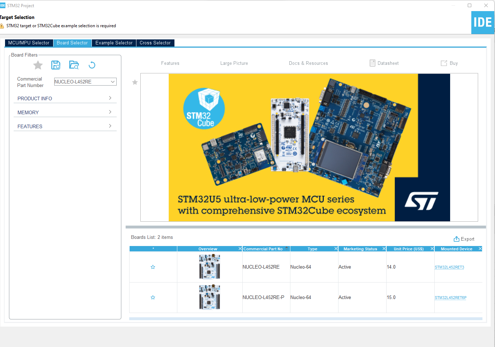
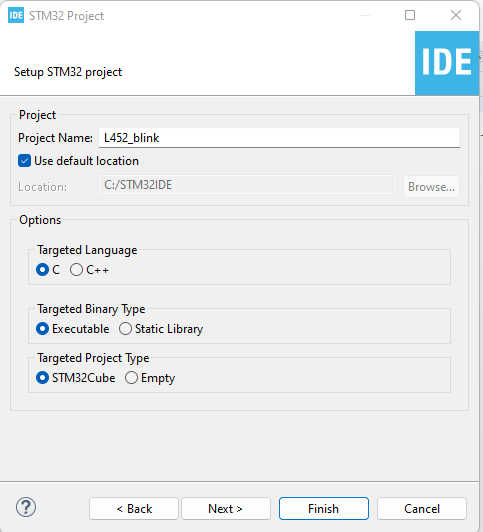
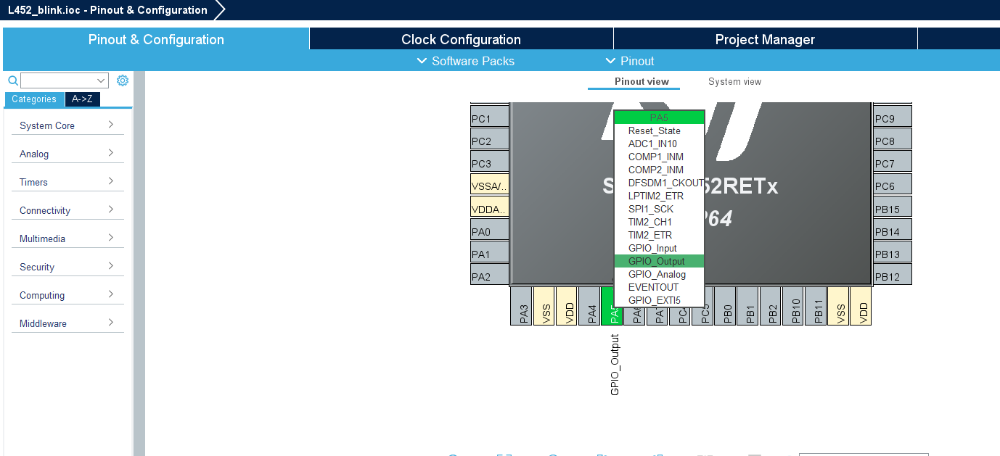
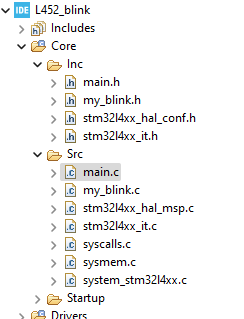
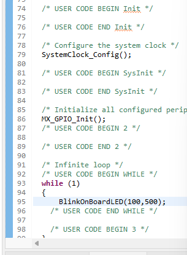
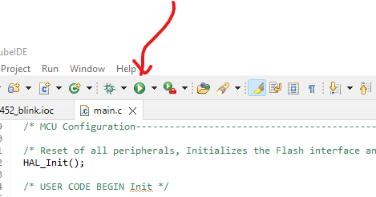
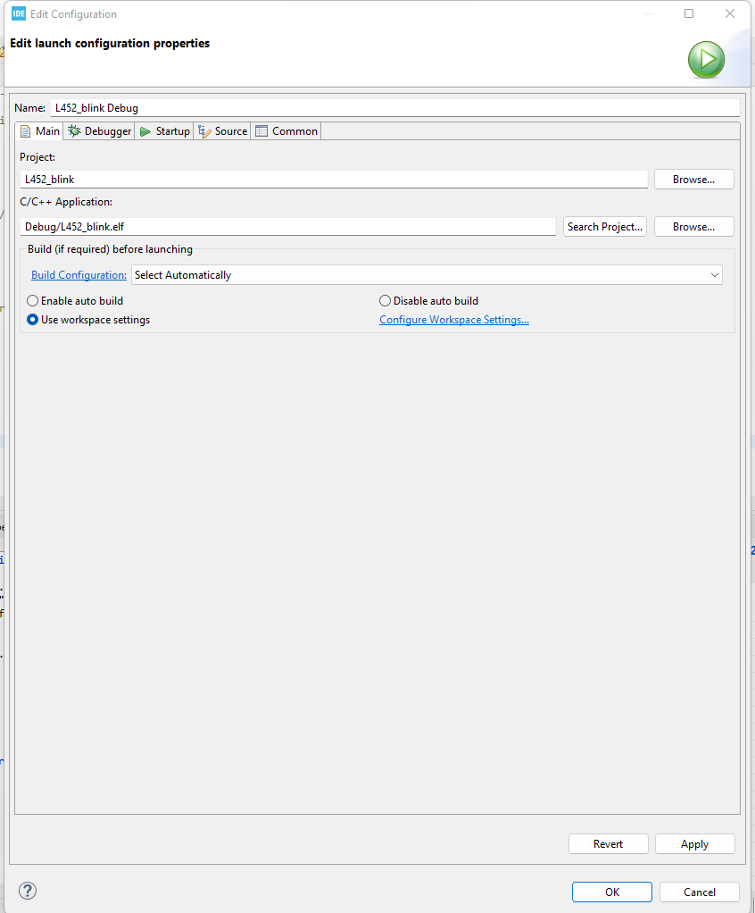
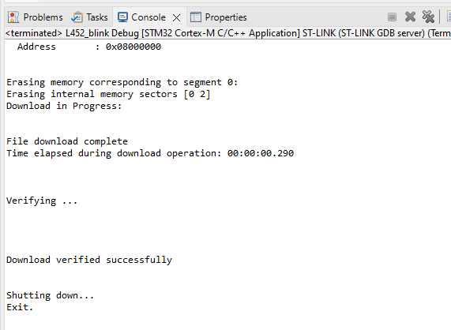

# L452_RE_blink

1. Open STM Cube, go File >> New >> STM32 Project. 
2. Target Selecttion >> Board Selector >> Commcercial Part Number >> Type L452 >> Select Nucleo-L452RE 
3. Click Next
4. Give a meaningfull name for the project. Keep others as default. 
5. Click Finish
6. In Pinout and Configuration, assign PA5 as GPIO_output 
7. Copy my_blink.h into Core >> Inc and my_blink.c into Core >> Src 
8. Use any function debug or toggle inside the while() {loop}. 
9. Hit "Run" button 
10. "Edit Launch Configuration Properties" 
11. Look for "Download Verified Successfully". Shutting down 
12. [See the demonstration here](https://youtube.com/shorts/RZo_RBDG4Vc?feature=share)
13. [embed] https://github.com/alimul-khan/L452_RE_blink/blob/main/UM2324%20STM32%20Nucleo-64%20Boards%20(MB1360).pdf [/embed]
14. [embed]http://example.com/file](https://github.com/alimul-khan/L452_RE_blink/blob/main/UM2324%20STM32%20Nucleo-64%20Boards%20(MB1360).pdf[/embed]
